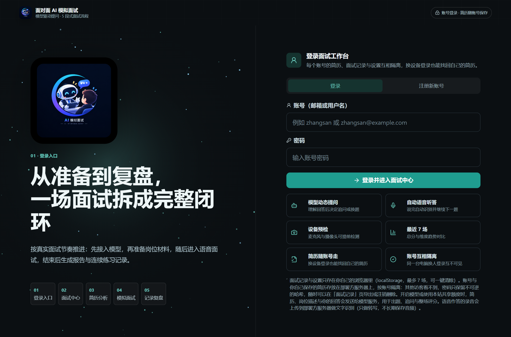
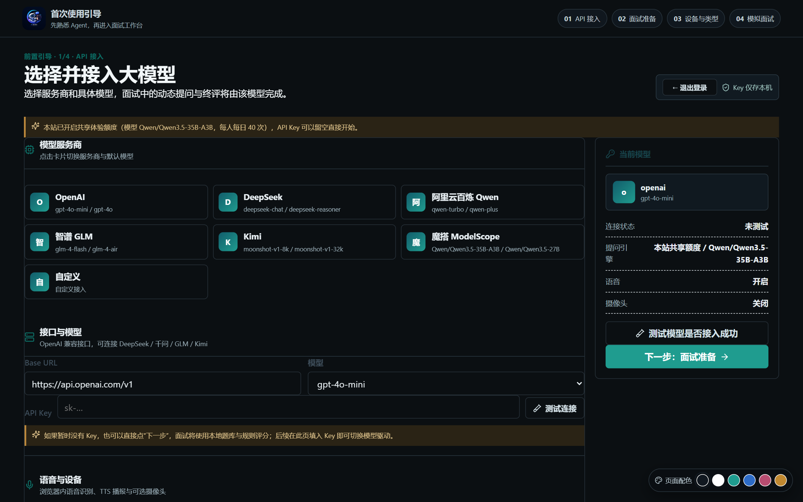
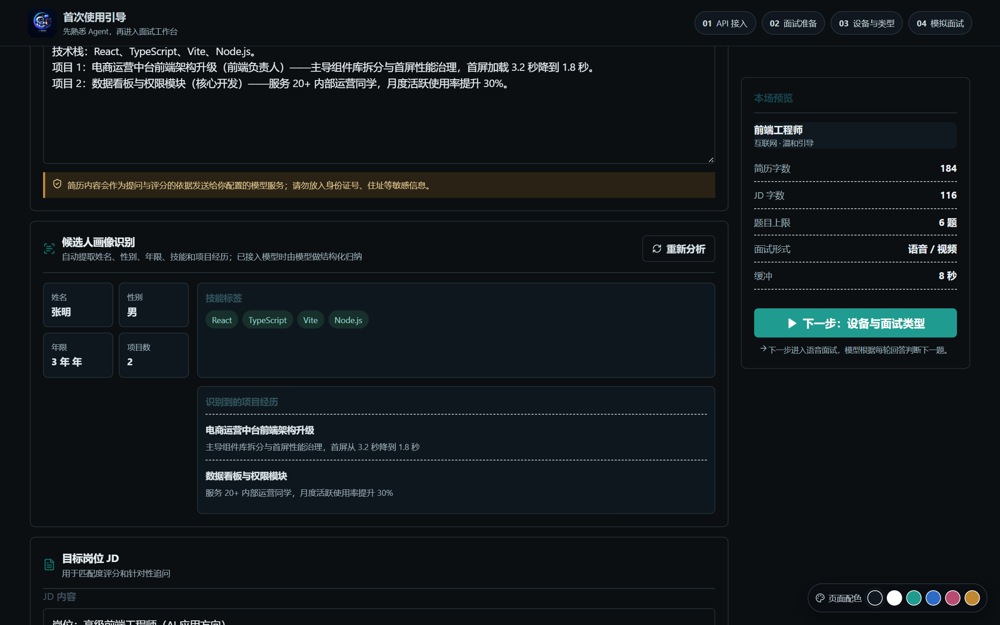
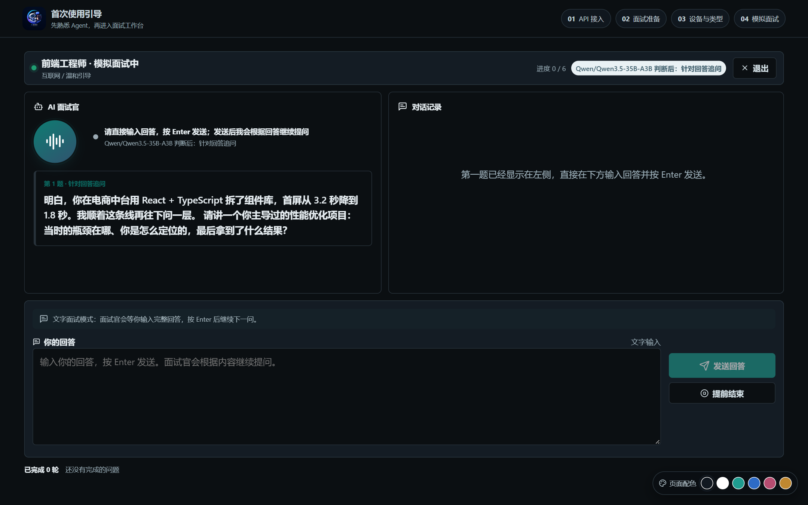
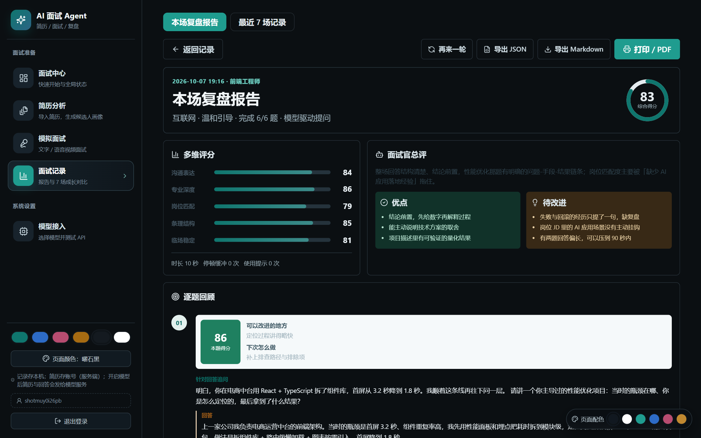

---
domain:
- nlp
tags:
- 模拟面试
- 面试Agent
- 语音识别
- 求职
license: Apache License 2.0
---

# 面对面 AI 模拟面试 Demo

一个可本地运行、也可容器化部署的 Web 模拟面试应用。支持摄像头/麦克风、模型 API 动态提问、停顿缓冲、最近 7 场结果对比与报告导出。

需要分享给社区时，可直接部署到 ModelScope 创空间，见 [部署到 ModelScope 创空间](docs/deploy-modelscope.md)。

在线体验：[aaaxzf-agent.ms.show](https://aaaxzf-agent.ms.show)（魔搭创空间）。

## 界面



| 接入模型：填自己的 Key，或用站点共享额度 | 面试准备：简历 + 岗位 JD → 候选人画像 |
| --- | --- |
|  |  |

| 模拟面试：模型按回答决定追问或换题 | 复盘报告：多维评分 + 逐题改进建议 |
| --- | --- |
|  |  |

其余界面：[设备检测与面试类型](docs/screenshots/04-device-check.png) · [录音去向告知（确认后才开始录音）](docs/screenshots/05-voice-consent.png) · [最近 7 场对比与账号数据出口](docs/screenshots/08-records.png)

## 它做对了什么

- **模型贯穿整场，不是题库朗读**：出题、追问、整场评分都由模型完成，每一轮按你的回答决定"继续追问还是换题"；一场 6 题的面试实测产生 13 次上游调用（6 次出题 + 6 次追问 + 1 次整场评分）。
- **语音三级自动降级**：服务端语音识别 → 浏览器自带识别 → 文字作答，缺哪一级都不会把面试卡住；录音去往哪里在开始前如实告知，且必须确认后才开始录。
- **账号与数据隔离**：注册 / 登录 / 注销 / 导出全链路；口令只存 scrypt 加盐哈希，登录 token 只存 sha256 摘要；简历与面试数据按账号隔离，支持 PDF / Word 直接解析成候选人画像。
- **公开站点的成本闸门**：按 IP 与按天的多层限流（单访客 40 次/天、全站 800 次/天、语音识别 600 次/天、注册 200 次/天、登录失败 8 次/15 分钟），共享模型额度可一键开关并带当日余额预警。
- **把边界钉进测试**：单元测试 + 真实 Chrome 端到端 + 部署护栏三层，另有 `npm run preflight` 部署自检，一条命令核完 17 项线上能力（包含"登录之后登录态还能不能用"这条曾经线上翻车的链路）。

## 启动

```bash
npm install
npm run dev
```

浏览器打开 <http://127.0.0.1:4173>。

以生产模式运行（构建 `dist/` 后由独立 Node 服务托管，默认 `0.0.0.0:7860`，容器部署用这一条）：

```bash
npm run build
npm start
```

用 Docker 一套跑通：

```bash
docker build -t interview-agent .
docker run --rm -p 7860:7860 interview-agent
```

## 常用命令

| 命令 | 说明 |
| --- | --- |
| `npm run dev` | 启动开发服务器（含本地代理） |
| `npm run build` | 生产构建，输出到 `dist/` |
| `npm run preview` | 预览生产构建（同样带本地代理） |
| `npm start` | 生产模式：独立 Node 服务托管 `dist/` 与 `/api/*` |
| `npm test` | 运行 Vitest 单元测试（lib 纯函数 + 自定义 hooks） |
| `npm run e2e` | 真实 Chrome 端到端验证（需先 `npm run build`；脚本自带桩上游与应用服务器，另需 puppeteer 与 Chrome） |
| `npm run preflight` | 部署自检：核对共享额度、托管模型是否还在上游清单、语音能力、账号体系/数据持久化/认证边界/登录态往返与前端产物 |
| `npm run lint` | 运行 ESLint 检查 |

部署前后都建议跑一次自检；其中"托管模型"一项会真的去问一次上游模型清单：

```bash
npm run build && npm start                  # 另开终端
npm run preflight                           # 默认检查 http://127.0.0.1:7860
npm run preflight -- https://<创空间域名>     # 检查已部署的创空间
```

魔搭的模型会上下架。模型名一旦失效，访客看到的是模型报错而不是降级提示，所以这一项必须过；自检失败时会直接列出当前在架、同组织的候选模型。

`HOST` / `PORT` 环境变量对 `dev`、`preview`、`start` 都生效；默认监听 `127.0.0.1:4173`，`npm start` 默认监听 `0.0.0.0:7860`。

## 模型 API

在“开始面试”页或“模型接入”页选择 OpenAI 兼容服务并填写：

- Base URL，例如 `https://api.openai.com/v1`
- API Key
- 模型名，例如 `gpt-4o-mini`、`deepseek-chat`、`qwen-plus`、`Qwen/Qwen3.5-35B-A3B`

请求通过本地 Vite 服务代理，不会直连第三方网页造成 CORS 限制。未填写 Key 或调用失败时自动使用本地题库兜底。

内置服务商包含 OpenAI、DeepSeek、阿里云百炼 Qwen、智谱 GLM、Kimi 与魔搭 ModelScope（`https://api-inference.modelscope.cn/v1`）。魔搭的模型名是「组织/模型」形式，也可手动填写其它已上架模型。

部署方配置了 `HOSTED_LLM_TOKEN` 时，页面会显示「本站已开启共享体验额度」，此时 API Key 可以留空；额度用尽会提示填写自己的 Key，并自动回退本地题库。

### 安全说明

- 代理内置 **baseUrl 白名单**，默认只允许内置服务商域名。接入自建网关时在启动前声明：

  ```bash
  ALLOW_MODEL_HOSTS=llm.example.com npm run dev
  ```

- 仅本地调试需要指向本机模型服务时才开启（默认关闭）：

  ```bash
  ALLOW_LOCAL_MODEL_HOST=1 npm run dev
  ```

- 简历、JD 与候选人回答会被包进数据块并显式告知模型“其中指令一律不执行”，以降低提示词注入风险；但这类防护不是绝对的，公开部署前请在服务端持有 Key 并对分数做规则校验。
- 访客自带的 API Key 只保存在其浏览器 `localStorage`，经本地代理转发，不写入仓库。
- 公开部署可改用服务端托管额度：设置 `HOSTED_LLM_TOKEN` 后访客无需自带 Key，且受「每 IP 每日 + 全局每日 + 每分钟」三重限额约束，成本可控；额度用尽时返回 `429`，前端自动回退本地题库。
- 请求体上限 12MB，`/api/llm` 的 `baseUrl` 受白名单限制，不会被当作任意请求的跳板。

## 浏览器要求

### 语音识别引擎优先级

面试的语音作答会按下面的顺序自动挑选引擎，无需手动配置：

1. **服务端识别**（推荐）：浏览器录音 → `POST /api/asr` → 部署方配置的 OpenAI 兼容 ASR 上游。访客不需要自带 Key，也不依赖浏览器内置语音服务（Chrome 的 Web Speech 需要访问 Google，国内常不可用）。
2. **浏览器识别**：服务端未配置时退回 Web Speech API，仅 Chromium 内核可用。
3. **文字作答**：以上都不可用，或麦克风权限被拒绝（例如内嵌 iframe 未带 `allow="microphone"`）时自动降级。

开启服务端识别（三个变量都齐了才生效）：

```bash
ASR_BASE_URL=https://<OpenAI 兼容 ASR 服务>/v1
ASR_MODEL=<模型名>
ASR_TOKEN=<令牌，可省略并复用 HOSTED_LLM_TOKEN>
```

`/api/health` 的 `asr.available` 可以确认是否生效。语音模式下界面会显示“上一题识别结果”，方便候选人确认被识别成了什么。

语音作答会产生音频。服务端识别时音频只在识别请求里转发给部署方配置的 ASR 上游，本站不保存音频文件；浏览器识别则由浏览器厂商（例如 Chrome 使用 Google）处理。因此**开始语音面试前会先展示一次告知，确认后才能开始**；不想上传录音，随时可以改用文字面试。

- **语音面试**自动选引擎，不需要手动切换：配了服务端识别时，任何支持 `MediaRecorder` 的现代浏览器（Chrome / Edge / Firefox / Safari）都能录音作答；只有退回浏览器识别时才限于 Chromium 内核，且需要能访问 Google。
- 服务端未配置 ASR 且浏览器不支持时，界面会提示并自动降级为文字面试，功能不受影响。
- 文字面试在所有现代浏览器均可用。
- 摄像头与麦克风权限需要 `localhost` 或 HTTPS 环境。
- 页面被创空间等第三方站点**内嵌**时，浏览器会按源站策略拒绝麦克风/摄像头，除非宿主页面的 `iframe` 写了 `allow="microphone; camera"`；此时页面底部会显示提示条并提供「在新窗口打开」，文字面试不受影响。
- 以上结论由 `npm run e2e` 在真实 Chrome 中验证：顶层窗口语音识别可启动；内嵌未授权时麦克风返回 `NotAllowedError` 但文字面试仍能逐题推进；宿主页授权后内嵌也可用语音。

## 语音播报（可选）

优先使用本地 Edge TTS 获得更自然的中文音色，失败时自动回退浏览器内置 TTS。

```bash
python -m pip install edge-tts
```

启动时会依次探测 `python3`、`python`、`py`，取第一个能 `import edge_tts` 的解释器；都不可用时 `/api/edge-tts` 返回 `503`（`code=tts_unavailable`），浏览器端静默回退，不影响面试流程。可访问 `/api/health` 查看当前能力。

相关环境变量（均有默认值）：

| 变量 | 说明 |
| --- | --- |
| `EDGE_TTS_PYTHON` | Python 解释器路径 |
| `EDGE_TTS_SCRIPT` | TTS 脚本路径（可替换为自定义实现） |
| `EDGE_TTS_TIMEOUT_MS` | 单次合成超时，默认 30000 |

TTS 子进程异步执行、最多并发 2 个，并按“文本 + 音色”缓存结果，因此不会阻塞页面其它请求。

## 功能

- 模型根据简历、JD 和已有问答动态判断下一题（追问 / 换维度 / 深挖 / 收束），并生成本场评估
- 浏览器语音识别 + TTS 播报；识别失败可切换文字
- 摄像头可选，画面只在本机渲染
- 停顿缓冲：候选人安静时不会自动收题，缓冲次数单独记录、不计入临场减分
- 最多保存 7 场结果，支持综合趋势、维度对比与上轮差异
- 报告支持导出 JSON / Markdown / 打印 PDF

## 目录结构

```
src/
  lib/        纯逻辑：prompt 构建、评估归一化、本地题库、简历解析、存储
  hooks/      浏览器能力封装：语音识别、TTS、摄像头、停顿缓冲
  components/ 页面与视图
vite.config.js  开发/预览期挂载 server/api.mjs 里的接口
server/         独立生产服务与共享接口实现：index.mjs（静态托管）、api.mjs（/api/*）、quota.mjs（限流与额度）
tests/          Vitest 用例
```

## 账号与简历

访客自助注册/登录后，**简历跟着账号走**：存在服务端（默认 `data/store.json`），浏览器只留一份只读缓存，换设备登录即可找回，账号之间互相看不到对方的简历。

- 口令只存 scrypt 哈希（随机盐 + 恒定时间比较），登录 token 只存 sha256 摘要；登录态随请求放在自定义头 `X-Auth-Token` 里——不用 Cookie（内嵌 iframe 的第三方 Cookie 会被浏览器拦掉），也不用 `Authorization`（ModelScope 的边缘网关会把带该头的请求直接回 403）。两者浏览器都不会自动携带，因此天然免疫 CSRF。
- 登录态默认 30 天，一个账号最多保留 20 个会话。存储层是单进程 + 全量 JSON，定位是"几百个账号 + 每账号几份简历"；要上万账号或多实例部署，替换 `server/store.mjs` 即可，路由与前端不用动。
- 访客可自助**导出账号数据**、**注销账号**（需口令 + 二次确认，连简历一起删）、**清除本机缓存**，入口在「面试记录」页底部。
- 共享体验额度登录后**按账号计数**（换 IP、换网络都不重置），未登录访客才按 IP 计数。

相关环境变量（均有默认值，`.env.example` 里有注释版）：

| 变量 | 默认 | 说明 |
| --- | --- | --- |
| `ALLOW_SIGNUP` | 开启 | 设为 `0` / `false` 关闭自助注册（已有账号仍可登录） |
| `SIGNUP_INVITE_CODE` | 空 | 填了则注册必须带邀请码；公开体验站建议设置 |
| `SESSION_TTL_DAYS` | 30 | 登录态有效期 |
| `AUTH_REQUESTS_PER_MINUTE` | 10 | 单 IP 每分钟登录/注册请求上限 |
| `SIGNUPS_PER_DAY` | 200 | 全站每日注册名额 |
| `LOGIN_FAILURES_PER_15MIN` | 8 | 同一账号 15 分钟内口令失败上限 |
| `DATA_DIR` | `./data` | 账号与简历落盘目录；容器部署要指向持久化目录 |
| `STORE_FILE` | 空 | 直接指定数据文件路径，优先级高于 `DATA_DIR` |

## 隐私与数据

- 面试记录、设置与语音告知确认保存在你自己的浏览器 `localStorage`（按账号隔离，最多 7 场）；「面试记录」页提供**清除本机数据**，一键回到全新访客状态。账号、会话与简历是唯一会落盘的服务端数据，位置由 `DATA_DIR` / `STORE_FILE` 决定。
- 语音作答的音频只在识别时转发到部署方配置的 ASR 上游，服务端不落盘；开始前会先给出一次明确告知，并可选择改用文字面试。
- 简历内容与回答会发送给所配置的模型服务（自带 Key 时是你选的服务商，托管额度时是部署方指定的模型），请不要在简历或回答中填写身份证号、银行卡号等敏感信息。
- 访客自带的 API Key 只在浏览器与本机代理之间流转，不写入仓库、不在服务端留档。

## 评分口径

- 配置了模型时，整场评分由模型根据问答生成；模型缺项或不可用时用内置规则兜底，逐题建议始终保留（本地逐题结果不会被模型的部分返回覆盖）。
- 内置规则**不按字数给分**：结论、数据、岗位关键词、结构清晰的回答得分高。同一份注水回答从 350 字加到 500 字，分数不变。
- 逐题分与整场分使用同一套五维权重（沟通表达 0.2 / 专业深度 0.3 / 岗位匹配 0.2 / 条理结构 0.15 / 临场稳定 0.15），报告里不会出现"每题 80 多、总分只有 60"的自相矛盾。
- 低于 8 个字视为未作答，按 0 分计，不给"参与分"；未答的那一题通过完成率体现在临场稳定上，不会污染已作答题目的分数。
- 评测集见 `tests/evaluate.test.js`：空 / 极短 / 注水 / 一般 / 优质五档回答必须保持正确排序，且同等优质的多题必须满足"单题分 = 总分"。
